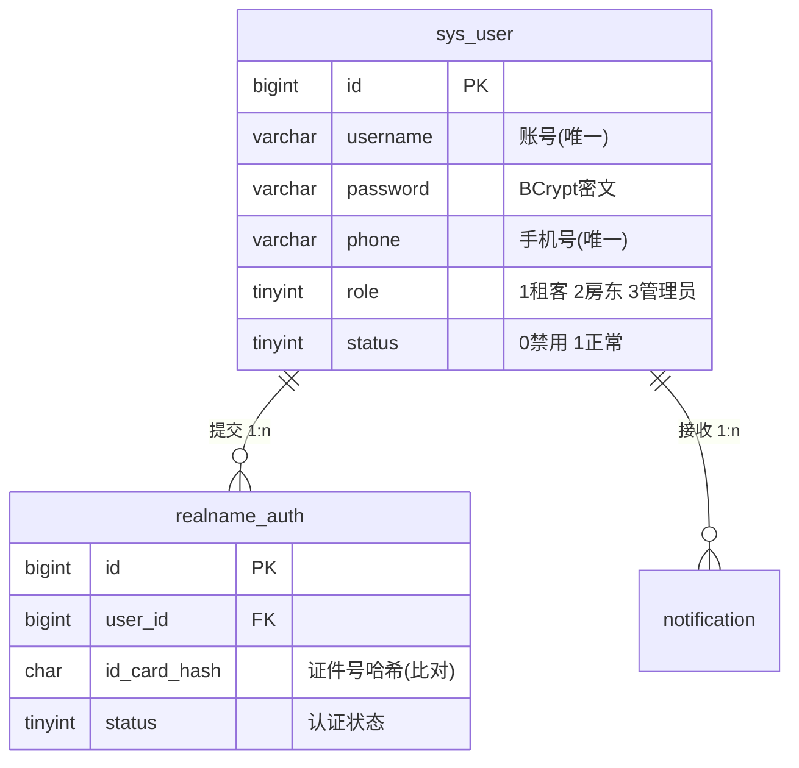
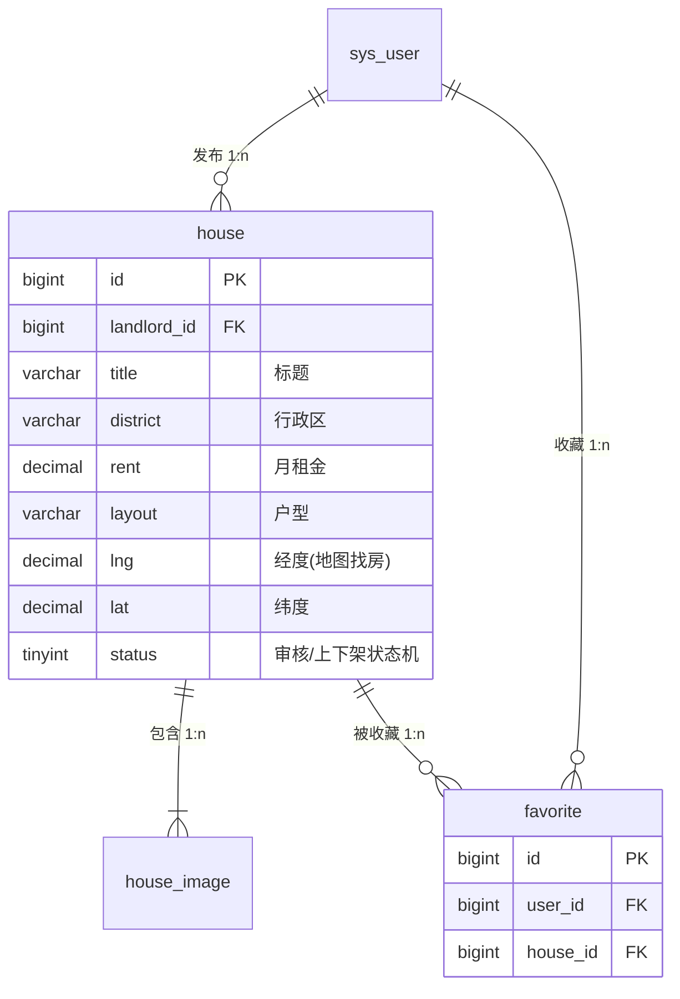
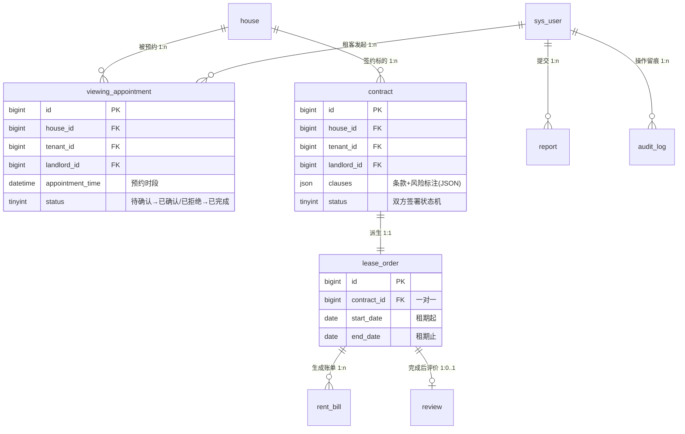
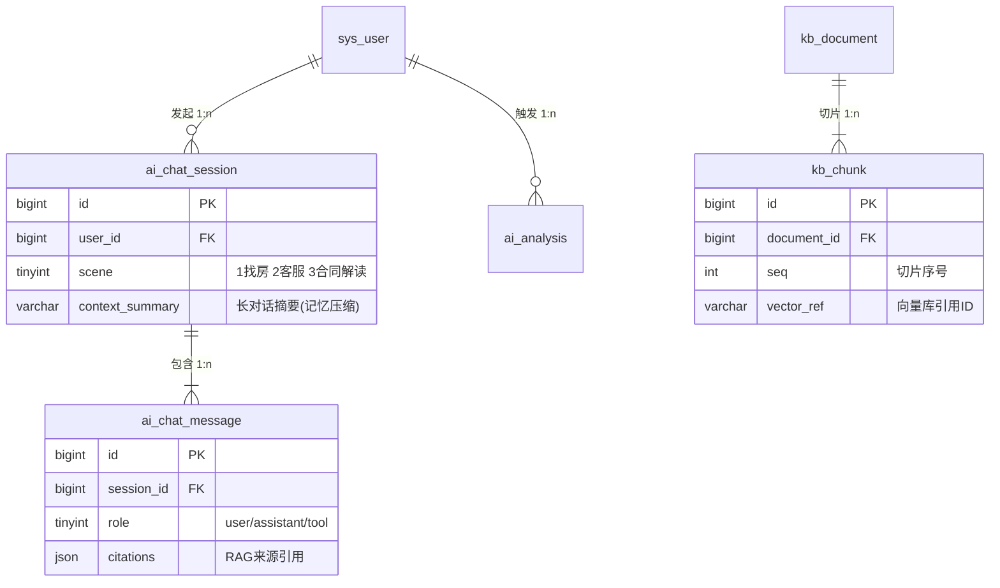

# RentAgent 数据库设计简介

> 项目名称：RentAgent —— 基于 AI 智能体的房屋租赁系统
> 文档版本：v1.3（v1.3 修订日期：2026-09-17，补记 ai_chat_message 工具调用留痕的写入口径，见版本记录）
> 编写日期：2026-09-13（按课程进度计划，2026-09-15"概要设计说明以及数据库设计简介"节点交付评审）
> 编制：李天泽（文档 / 数据）　参与评审：项目组全体
> 关联文档：《需求分析矩阵》v1.1、《概要设计说明》v1.6、《需求跟踪矩阵》v1.1

---

## 一、引言

### 1.1 编写目的

本文档是 RentAgent 业务数据库（MySQL 8）的概念结构设计、逻辑结构设计与物理设计说明，演示"从用例规约识别 E-R 图 → 关系模式 → 数据表"的完整设计路径，供详细设计、建库建表与后续《接口文档》编写使用。全文共设计 **18 张表**，覆盖用户、房源、交易、AI 四大业务域。

### 1.2 设计依据

- 《需求分析矩阵》v1.1：25 项功能需求（FR-01~25）与 10 项非功能需求（NFR-01~10），是实体与联系识别的直接输入；
- 《概要设计说明》v1.0：数据架构约定（MySQL 8 + Redis 7 + Redis Stack 向量检索）；
- 高保真原型 23 页（P00~P22）：页面字段即实体属性的最直观来源。

## 二、数据库设计方法与流程

### 2.1 设计阶段划分

数据库设计按"六个阶段"组织，本项目处于第 2~4 阶段（第 5 阶段随编码实施、第 6 阶段随运行维护）：

| 阶段 | 任务 | 本项目产出 |
| ---- | ---- | ---------- |
| ① 需求分析 | 数据与处理需求收集 | 《需求分析矩阵》FR-01~25 |
| ② 概念结构设计 | 与 DBMS 无关的 E-R 模型 | 第三章：实体/联系/E-R 图 |
| ③ 逻辑结构设计 | E-R → 关系模式 → 规范化 | 第四章：18 个关系模式与数据字典 |
| ④ 物理结构设计 | 存储引擎、索引、完整性约束 | 第五章：索引与约束设计 |
| ⑤ 数据库实施 | 建库建表、数据装载 | DDL 脚本（编码阶段随代码入库） |
| ⑥ 运行与维护 | 备份、恢复、调优 | NFR-10 备份策略（第七章） |

### 2.2 根据用例规约识别 E-R 图的方法（核心方法）

课堂上讲解的"根据用例规约识别 E-R 图"方法，本项目完整实践如下四步：

| 步骤 | 做法 | 判别要点 |
| ---- | ---- | -------- |
| ① 提取候选实体 | 通读用例规约（用例名、主/参与者、基本流、备选流）与验收标准，摘出所有**名词** | 名词四类：人/物（租客、房东、房源）、事件（预约、签约、支付）、抽象概念（评价、通知）、属性误判（租金、状态——先记录后甄别） |
| ② 甄别实体与属性 | 用"两个判别问题"筛选：**需要独立描述吗？**（有自己的多个属性）；**会被其他实体引用吗？**（有独立生命周期） | 需要独立描述且被引用 → 实体；仅作描述且依附单一实体 → 属性。"租金"依附于房源/合同 → 属性；"看房预约"有独立状态流转 → 实体 |
| ③ 识别联系与基数 | 摘出实体间的**动词**，逐对判断：有无联系？基数（1:1、1:n、m:n）？是否需要联系属性？ | m:n 联系（如"用户—收藏—房源"）必须独立成表；带联系属性的联系（如"评价"带分数与内容）也独立成表 |
| ④ 集成与优化 | 各用例局部 E-R 图合并为全局 E-R：消除同名异义/异名同义、消除冗余联系，再按三范式规范化 | 同一"房源"在各用例中属性口径必须一致；可传递依赖拆表 |

#### 方法应用示例一：FR-17 预约看房

用例规约要点：*租客选择日期时段发起看房预约，房东确认/拒绝，双方收到通知；时间段冲突时禁止重复预约；状态流转：待确认→已确认/已拒绝→已完成。*

| 分析 | 结果 |
| ---- | ---- |
| 名词提取 | 租客、房东、日期时段、看房预约、房源、通知、状态 |
| 实体甄别 | 租客/房东/房源 → 已有实体（被引用）；**看房预约** → 有独立状态与生命周期，实体；通知 → 实体（多类型复用）；"日期时段""状态" → 属性 |
| 联系识别 | 租客*发起*预约（1:n）；房源*被预约*（1:n）；预约*关联*房东（1:n，冗余落列以便房东侧查询）；通知*归属*用户（1:n） |
| 设计结论 | `viewing_appointment` 表：tenant_id、house_id、landlord_id、appointment_time、status……；(house_id, appointment_time) 唯一索引落实"禁止重复预约"验收标准 |

#### 方法应用示例二：FR-18 在线签约

用例规约要点：*确认租赁意向后，系统基于模板生成电子合同（自动填充双方信息），双方在线确认签约，AI 解读入口内嵌；签约后合同状态与副本可查。*

| 分析 | 结果 |
| ---- | ---- |
| 名词提取 | 租赁意向、电子合同、模板、租客、房东、合同条款、风险标注、副本、状态 |
| 实体甄别 | **电子合同** → 实体（状态机 + 副本留存）；合同模板 → 演示期模板固定为文件资产，不建表；条款/风险标注 → 合同 JSON 字段（读多写少、整体存取）；"意向" → 合同的初始状态，不单独成实体 |
| 联系识别 | 租客 1:n 合同；房东 1:n 合同；房源 1:n 合同；签约成功后合同 1:1 派生**租赁订单** |
| 设计结论 | `contract` 表（双方 id + 房源 id + 条款 JSON + 双方签署时间 + 状态机）；`lease_order` 以 contract_id 一对一挂接，订单再派生 1:n `rent_bill` |

### 2.3 常用数据库设计工具

| 工具 | 类型 | 特点 | 适用场景 |
| ---- | ---- | ---- | -------- |
| PowerDesigner | 商业（收费） | 老牌 CASE 工具，概念/逻辑/物理三模型正向逆向工程，支持 LDM/PDM 互换 | 企业级大型项目 |
| PDMan / Chiner | 开源免费（国产） | 中文界面，逻辑模型 → 物理模型 → DDL 导出，数据字典管理友好 | 中小项目、教学项目 |
| MySQL Workbench | 免费官方 | EER 图 + 建模 + SQL 开发一体，与 MySQL 8 契合度高 | MySQL 单库项目 |
| Navicat（模型功能） | 商业 | 建模与日常库表管理同平台，上手快 | 已购 Navicat 的团队 |
| dbdiagram.io / draw.io | 在线免费 | 轻量绘图，导出图片/PDF，适合文档插图 | E-R 草图与文档配图 |
| Mermaid（erDiagram） | 开源文本化 | 图即代码，随 Git 版本化，GitHub 原生渲染 | 与代码仓共存的持续维护型设计文档 |

**本项目选型**：采用 **Mermaid erDiagram 绘制 E-R 图 + DDL 脚本直连 MySQL 8 验证**的组合。理由：① 免费、零安装，团队五人协作门槛最低；② 图随文档进 Git，评审、改版全程可追溯（与项目文档工作流一致）；③ DDL 在 MySQL 8 实例直接验证，避免建模工具导出脚本与真实库二次同步。若后期表规模显著增长，可引入 PDMan/Chiner 做数据字典托管。

## 三、概念结构设计（E-R 模型）

### 3.1 实体清单与来源追溯

按 2.2 节方法对全部用例规约（FR-01~25）执行"名词提取 → 甄别"，共识别 **18 个实体**（含 6 个 m:n 或带联系属性的联系实体）：

| # | 实体（表名） | 中文名 | 来源用例 / 需求 |
| - | ------------ | ------ | ---------------- |
| 1 | sys_user | 用户（租客/房东/管理员） | FR-01/02/04/22 |
| 2 | realname_auth | 实名认证记录 | FR-03、FR-18 前置条件 |
| 3 | notification | 站内通知 | FR-07/17/18/19/21/23 |
| 4 | house | 房源 | FR-05/06/07/09/10/15 |
| 5 | house_image | 房源图片 | FR-05/08 |
| 6 | favorite | 收藏（用户↔房源 m:n） | FR-11/25 |
| 7 | viewing_appointment | 看房预约 | FR-17 |
| 8 | contract | 电子合同 | FR-14/18 |
| 9 | lease_order | 租赁订单 | FR-19 |
| 10 | rent_bill | 租金账单 | FR-19 |
| 11 | review | 评价（订单↔用户的联系实体） | FR-20 |
| 12 | report | 举报 | FR-23 |
| 13 | audit_log | 审计日志 | FR-07/22/23 留痕 |
| 14 | ai_chat_session | AI 会话 | FR-12/13/14 |
| 15 | ai_chat_message | AI 对话消息（含工具调用记录） | FR-12/13/14、NFR-05 |
| 16 | ai_analysis | AI 分析结果（定价/检测/解读） | FR-08/14/15/16 |
| 17 | kb_document | 知识库文档 | FR-13、NFR-05 |
| 18 | kb_chunk | 知识库切片（向量溯源单位） | FR-13、RAG 引用 |

> 说明：AI 会话中"多轮记忆"不单独建实体——会话记忆 = ai_chat_message 的窗口读取 + 摘要字段，避免过度建模。

### 3.2 局部 E-R 图（分业务域）

> 图即代码（Mermaid erDiagram），GitHub 可直接渲染；符号约定：`||--o{` 一对多（0..n）、`||--||` 一对一、`}o--o{` 多对多；PK 主键、FK 外键。

#### （1）用户域

#### （2）房源域

#### （3）交易域

#### （4）AI 域

### 3.3 联系总览（全局 E-R 的表格化表达）

18 个实体集成后的全部联系（冗余联系已消除，如"租客→房源"的直达联系经由预约/合同/收藏表达，不再另画）：

| 实体 A | 联系 | 实体 B | 基数 | 落库方式 |
| ------ | ---- | ------ | ---- | -------- |
| sys_user | 发布 | house | 1:n | house.landlord_id |
| sys_user | 提交 | realname_auth | 1:n | realname_auth.user_id |
| sys_user | 接收 | notification | 1:n | notification.user_id |
| house | 包含 | house_image | 1:n | house_image.house_id |
| sys_user ↔ house | 收藏 | favorite | m:n | favorite 独立表（UNIQUE(user_id, house_id)） |
| house | 被预约 | viewing_appointment | 1:n | viewing_appointment.house_id |
| sys_user | 发起预约 | viewing_appointment | 1:n | viewing_appointment.tenant_id（landlord_id 为查询冗余列） |
| house | 签约标的 | contract | 1:n | contract.house_id |
| sys_user | 租客签署 | contract | 1:n | contract.tenant_id |
| contract | 派生 | lease_order | 1:1 | lease_order.contract_id（UNIQUE） |
| lease_order | 生成 | rent_bill | 1:n | rent_bill.lease_order_id |
| lease_order | 被评价 | review | 1:0..1 | review.lease_order_id（UNIQUE，一单一评） |
| sys_user | 提交 | report | 1:n | report.reporter_id |
| sys_user | 操作留痕 | audit_log | 1:n | audit_log.operator_id |
| sys_user | 发起 | ai_chat_session | 1:n | ai_chat_session.user_id |
| ai_chat_session | 包含 | ai_chat_message | 1:n | ai_chat_message.session_id |
| sys_user | 触发 | ai_analysis | 1:n | ai_analysis.user_id |
| kb_document | 切片 | kb_chunk | 1:n | kb_chunk.document_id |

## 四、逻辑结构设计（关系模式与数据字典）

### 4.1 E-R 图 → 关系模式转换规则

| E-R 结构 | 转换规则 | 本项目实例 |
| -------- | -------- | ---------- |
| 实体 | → 关系模式，实体名即表名 | house |
| 1:n 联系 | 在 n 端加入 1 端主键为外键 | house.landlord_id |
| 1:1 联系 | 任一端加外键并加 UNIQUE | lease_order.contract_id |
| m:n 联系 | 独立成关系模式，两端主键组合或代理键 | favorite |
| 带联系属性的联系 | 独立成表，联系属性转为列 | review（分数、内容） |
| 多值属性 | 拆表或 JSON | house.facilities → JSON；房源图片 → house_image 拆表 |
| 弱实体/整体-部分 | 随主实体级联删除 | house_image 随 house 删除 |

### 4.2 关系模式清单（18 个，主键加粗）

约定：下画线表示主键在 Markdown 中以**加粗**替代；`FK` 为外键。

1. sys_user（**id**，username，password，phone，email，nickname，avatar_url，role，status，deleted，created_at，updated_at）
2. realname_auth（**id**，user_id*FK*，real_name，id_card_no_enc，id_card_hash，status，reject_reason，audit_by，audit_time，created_at）
3. notification（**id**，user_id*FK*，type，title，content，ref_type，ref_id，is_read，created_at）
4. house（**id**，landlord_id*FK*，title，community，city，district，address，layout，area，orientation，floor_desc，rent，deposit_type，facilities，description，cover_url，lng，lat，view_count，avg_score，status，reject_reason，deleted，created_at，updated_at）
5. house_image（**id**，house_id*FK*，url，sort，is_cover，created_at）
6. favorite（**id**，user_id*FK*，house_id*FK*，created_at）
7. viewing_appointment（**id**，house_id*FK*，tenant_id*FK*，landlord_id*FK*，appointment_time，status，reject_reason，remark，created_at，updated_at）
8. contract（**id**，house_id*FK*，tenant_id*FK*，landlord_id*FK*，clauses，risk_flags，start_date，end_date，monthly_rent，deposit，status，signed_tenant_at，signed_landlord_at，created_at，updated_at）
9. lease_order（**id**，contract_id*FK*，house_id*FK*，tenant_id*FK*，landlord_id*FK*，start_date，end_date，monthly_rent，deposit，status，created_at，updated_at）
10. rent_bill（**id**，lease_order_id*FK*，period_no，due_date，amount，status，paid_at，remark，created_at）
11. review（**id**，lease_order_id*FK*，house_id*FK*，landlord_id*FK*，tenant_id*FK*，house_score，landlord_score，content，status，created_at）
12. report（**id**，reporter_id*FK*，target_type，target_id，reason，status，handle_by，handle_remark，handled_at，created_at）
13. audit_log（**id**，operator_id，action，target_type，target_id，detail，ip，created_at）
14. ai_chat_session（**id**，user_id*FK*，scene，title，context_summary，is_transferred，created_at，updated_at）
15. ai_chat_message（**id**，session_id*FK*，role，content，tool_name，tool_args，tool_result，citations，token_count，latency_ms，created_at）
16. ai_analysis（**id**，user_id，type，target_type，target_id，input_snapshot，result，model，created_at）
17. kb_document（**id**，title，category，source_url，content，status，chunk_count，created_at，updated_at）
18. kb_chunk（**id**，document_id*FK*，seq，content，token_count，vector_ref，created_at）

### 4.3 数据字典

> 类型为 MySQL 8 类型；金额一律 DECIMAL；时间为 DATETIME（东八区）；统一约定：主键 `id BIGINT UNSIGNED AUTO_INCREMENT`；逻辑删除 `deleted TINYINT DEFAULT 0`（仅业务主数据表使用）；所有表含 `created_at`，可变业务表含 `updated_at`。

#### （1）用户域

**表 1　sys_user（用户表）**

| 字段 | 类型 | 约束 | 说明 |
| ---- | ---- | ---- | ---- |
| id | BIGINT UNSIGNED | PK, AI | 主键 |
| username | VARCHAR(50) | NOT NULL, UNIQUE | 账号（注册唯一） |
| password | VARCHAR(100) | NOT NULL | BCrypt 密文（NFR-03） |
| phone | VARCHAR(20) | UNIQUE | 手机号（FR-01/02 登录标识） |
| email | VARCHAR(100) | | 邮箱 |
| nickname | VARCHAR(50) | | 昵称（FR-04） |
| avatar_url | VARCHAR(255) | | 头像地址 |
| role | TINYINT | NOT NULL | 1 租客 / 2 房东 / 3 管理员（简化 RBAC，方法级注解鉴权） |
| status | TINYINT | NOT NULL, DEFAULT 1 | 0 禁用 / 1 正常（FR-22 禁用即时生效） |
| deleted | TINYINT | DEFAULT 0 | 逻辑删除 |
| created_at / updated_at | DATETIME | NOT NULL | 审计字段 |

**表 2　realname_auth（实名认证表）**

| 字段 | 类型 | 约束 | 说明 |
| ---- | ---- | ---- | ---- |
| id | BIGINT UNSIGNED | PK, AI | 主键 |
| user_id | BIGINT UNSIGNED | NOT NULL, FK→sys_user | 认证人 |
| real_name | VARCHAR(50) | NOT NULL | 姓名 |
| id_card_no_enc | VARCHAR(255) | NOT NULL | 身份证号 AES 加密密文（NFR-04） |
| id_card_hash | CHAR(64) | NOT NULL | 身份证号 SHA-256 哈希（同号比对，密文不参与查询） |
| status | TINYINT | NOT NULL, DEFAULT 0 | 0 待审核 / 1 通过 / 2 驳回 |
| reject_reason | VARCHAR(200) | | 驳回理由 |
| audit_by / audit_time | BIGINT / DATETIME | | 审核人与时间 |
| created_at | DATETIME | NOT NULL | 提交时间 |

**表 3　notification（站内通知表）**

| 字段 | 类型 | 约束 | 说明 |
| ---- | ---- | ---- | ---- |
| id | BIGINT UNSIGNED | PK, AI | 主键 |
| user_id | BIGINT UNSIGNED | NOT NULL, FK→sys_user | 接收人 |
| type | TINYINT | NOT NULL | 1 预约 / 2 审核 / 3 签约 / 4 账单 / 5 举报 / 9 系统 |
| title | VARCHAR(100) | NOT NULL | 标题 |
| content | VARCHAR(500) | NOT NULL | 内容 |
| ref_type / ref_id | VARCHAR(30) / BIGINT | | 关联业务（跳转定位，FR-21） |
| is_read | TINYINT | DEFAULT 0 | 已读标记（FR-21 5 秒内可见未读） |
| created_at | DATETIME | NOT NULL | 触发时间 |

#### （2）房源域

**表 4　house（房源表）**

| 字段 | 类型 | 约束 | 说明 |
| ---- | ---- | ---- | ---- |
| id | BIGINT UNSIGNED | PK, AI | 主键 |
| landlord_id | BIGINT UNSIGNED | NOT NULL, FK→sys_user | 发布房东（须已实名，业务校验） |
| title | VARCHAR(100) | NOT NULL | 标题（FR-09 关键词匹配） |
| community | VARCHAR(100) | NOT NULL | 小区（FR-15 定价分组维度） |
| city / district / address | VARCHAR(50) / VARCHAR(50) / VARCHAR(200) | NOT NULL | 城市 / 行政区 / 详细地址（FR-09 筛选维度） |
| layout | VARCHAR(20) | NOT NULL | 户型，如"2室1厅" |
| area | DECIMAL(6,2) | NOT NULL | 面积 ㎡ |
| orientation | VARCHAR(10) | | 朝向（FR-09 筛选维度） |
| floor_desc | VARCHAR(20) | | 楼层描述 |
| rent | DECIMAL(10,2) | NOT NULL | 月租金（FR-09 租金区间筛选） |
| deposit_type | VARCHAR(20) | NOT NULL | 押付方式，如"押一付三" |
| facilities | JSON | | 设施清单（FR-09 设施筛选） |
| description | VARCHAR(2000) | | 描述（FR-08 AI 辅助填充对象） |
| cover_url | VARCHAR(255) | | 封面图（列表卡片） |
| lng / lat | DECIMAL(10,7) | NOT NULL | 经纬度（FR-10 地图找房范围查询） |
| view_count | INT UNSIGNED | DEFAULT 0 | 浏览数（FR-11 推荐热度因子） |
| avg_score | DECIMAL(3,1) | DEFAULT NULL | 均评分（FR-20 评价聚合冗余，展示用） |
| status | TINYINT | NOT NULL | 状态机：0 待审核 / 1 已通过 / 2 已驳回 / 3 已上架 / 4 已下架 / 5 已出租（FR-05/06/07） |
| reject_reason | VARCHAR(200) | | 驳回理由（FR-07） |
| deleted | TINYINT | DEFAULT 0 | 逻辑删除 |
| created_at / updated_at | DATETIME | NOT NULL | 审计字段 |

**表 5　house_image（房源图片表）**

| 字段 | 类型 | 约束 | 说明 |
| ---- | ---- | ---- | ---- |
| id | BIGINT UNSIGNED | PK, AI | 主键 |
| house_id | BIGINT UNSIGNED | NOT NULL, FK→house(CASCADE) | 所属房源 |
| url | VARCHAR(255) | NOT NULL | 图片地址 |
| sort | TINYINT | DEFAULT 0 | 排序 |
| is_cover | TINYINT | DEFAULT 0 | 是否封面 |
| created_at | DATETIME | NOT NULL | 上传时间 |

**表 6　favorite（房源收藏表，用户↔房源 m:n）**

| 字段 | 类型 | 约束 | 说明 |
| ---- | ---- | ---- | ---- |
| id | BIGINT UNSIGNED | PK, AI | 主键 |
| user_id | BIGINT UNSIGNED | NOT NULL, FK→sys_user | 收藏人 |
| house_id | BIGINT UNSIGNED | NOT NULL, FK→house | 被收藏房源 |
| created_at | DATETIME | NOT NULL | 收藏时间 |
| 约束 | | UNIQUE(user_id, house_id) | 防重复收藏（FR-25） |

#### （3）交易域

**表 7　viewing_appointment（看房预约表）**

| 字段 | 类型 | 约束 | 说明 |
| ---- | ---- | ---- | ---- |
| id | BIGINT UNSIGNED | PK, AI | 主键 |
| house_id | BIGINT UNSIGNED | NOT NULL, FK→house | 预约房源 |
| tenant_id | BIGINT UNSIGNED | NOT NULL, FK→sys_user | 发起租客 |
| landlord_id | BIGINT UNSIGNED | NOT NULL, FK→sys_user | 房东（查询冗余列，源于房源） |
| appointment_time | DATETIME | NOT NULL | 预约时段（起点） |
| status | TINYINT | NOT NULL, DEFAULT 0 | 0 待确认 / 1 已确认 / 2 已拒绝 / 3 已完成 / 4 已取消（FR-17 状态流转） |
| reject_reason | VARCHAR(200) | | 拒绝理由 |
| remark | VARCHAR(200) | | 租客留言 |
| created_at / updated_at | DATETIME | NOT NULL | 审计字段 |
| 约束 | | UNIQUE(house_id, appointment_time) | 同时段防重复预约（FR-17 验收标准） |

**表 8　contract（电子合同表）**

| 字段 | 类型 | 约束 | 说明 |
| ---- | ---- | ---- | ---- |
| id | BIGINT UNSIGNED | PK, AI | 主键 |
| house_id | BIGINT UNSIGNED | NOT NULL, FK→house | 签约房源 |
| tenant_id | BIGINT UNSIGNED | NOT NULL, FK→sys_user | 租客（至少登记姓名+联系方式，业务校验） |
| landlord_id | BIGINT UNSIGNED | NOT NULL, FK→sys_user | 房东（须已实名，业务校验） |
| clauses | JSON | NOT NULL | 模板渲染后的条款集合（整体存取的读多写少数据） |
| risk_flags | JSON | | AI 解读风险条款标注（FR-14，标红展示） |
| start_date / end_date | DATE | NOT NULL | 租期 |
| monthly_rent / deposit | DECIMAL(10,2) | NOT NULL | 月租 / 押金 |
| status | TINYINT | NOT NULL, DEFAULT 0 | 0 待租客确认 / 1 待房东确认 / 2 已生效 / 3 已退租 / 4 已作废 |
| signed_tenant_at / signed_landlord_at | DATETIME | | 双方签署时间（副本可查依据，FR-18） |
| created_at / updated_at | DATETIME | NOT NULL | 审计字段 |

**表 9　lease_order（租赁订单表）**

| 字段 | 类型 | 约束 | 说明 |
| ---- | ---- | ---- | ---- |
| id | BIGINT UNSIGNED | PK, AI | 主键 |
| contract_id | BIGINT UNSIGNED | NOT NULL, FK→contract, UNIQUE | 合同一对一派生 |
| house_id / tenant_id / landlord_id | BIGINT UNSIGNED | NOT NULL, FK | 三方落列（订单侧自包含查询） |
| start_date / end_date | DATE | NOT NULL | 租期 |
| monthly_rent / deposit | DECIMAL(10,2) | NOT NULL | 月租 / 押金 |
| status | TINYINT | NOT NULL, DEFAULT 0 | 0 在租 / 1 已退租 / 2 已到期（FR-19 续租/退租申请走状态机） |
| created_at / updated_at | DATETIME | NOT NULL | 审计字段 |

**表 10　rent_bill（租金账单表）**

| 字段 | 类型 | 约束 | 说明 |
| ---- | ---- | ---- | ---- |
| id | BIGINT UNSIGNED | PK, AI | 主键 |
| lease_order_id | BIGINT UNSIGNED | NOT NULL, FK→lease_order | 所属订单 |
| period_no | INT | NOT NULL | 第几期（签约时按租期生成计划，FR-19） |
| due_date | DATE | NOT NULL | 应付日 |
| amount | DECIMAL(10,2) | NOT NULL | 应付金额 |
| status | TINYINT | NOT NULL, DEFAULT 0 | 0 待支付 / 1 已支付 / 2 已逾期（仅记录，不对接支付） |
| paid_at | DATETIME | | 支付标记时间 |
| remark | VARCHAR(200) | | 备注 |
| created_at | DATETIME | NOT NULL | 生成时间 |
| 约束 | | UNIQUE(lease_order_id, period_no) | 账单期数唯一 |

**表 11　review（评价表，带联系属性的联系实体）**

| 字段 | 类型 | 约束 | 说明 |
| ---- | ---- | ---- | ---- |
| id | BIGINT UNSIGNED | PK, AI | 主键 |
| lease_order_id | BIGINT UNSIGNED | NOT NULL, FK→lease_order, UNIQUE | 一单一评（仅完成合同可评，FR-20 验收标准） |
| house_id / landlord_id / tenant_id | BIGINT UNSIGNED | NOT NULL, FK | 评价对象与评价人 |
| house_score | TINYINT | NOT NULL | 房源评分 1~5（CHECK 约束） |
| landlord_score | TINYINT | NOT NULL | 房东评分 1~5（CHECK 约束） |
| content | VARCHAR(500) | | 文字评价 |
| status | TINYINT | DEFAULT 0 | 0 正常 / 1 已隐藏（FR-23 举报处理后隐藏） |
| created_at | DATETIME | NOT NULL | 评价时间 |

**表 12　report（举报表）**

| 字段 | 类型 | 约束 | 说明 |
| ---- | ---- | ---- | ---- |
| id | BIGINT UNSIGNED | PK, AI | 主键 |
| reporter_id | BIGINT UNSIGNED | NOT NULL, FK→sys_user | 举报人 |
| target_type | TINYINT | NOT NULL | 1 房源 / 2 评价 / 3 用户 |
| target_id | BIGINT UNSIGNED | NOT NULL | 目标 id（多态关联，业务层校验） |
| reason | VARCHAR(200) | NOT NULL | 举报理由 |
| status | TINYINT | NOT NULL, DEFAULT 0 | 0 待处理 / 1 已处理 |
| handle_by / handle_remark / handled_at | BIGINT / VARCHAR(200) / DATETIME | | 处理人 / 意见 / 时间（处理结果通知双方，FR-23） |
| created_at | DATETIME | NOT NULL | 举报时间 |

**表 13　audit_log（审计日志表）**

| 字段 | 类型 | 约束 | 说明 |
| ---- | ---- | ---- | ---- |
| id | BIGINT UNSIGNED | PK, AI | 主键 |
| operator_id | BIGINT UNSIGNED | NOT NULL | 操作人（管理员/房东，逻辑关联） |
| action | VARCHAR(50) | NOT NULL | 动作：HOUSE_AUDIT / USER_BAN / REPORT_HANDLE / SIGN …（FR-07/22/23 留痕） |
| target_type / target_id | VARCHAR(30) / BIGINT | NOT NULL | 操作对象（多态关联） |
| detail | JSON | | 操作前后快照 |
| ip | VARCHAR(45) | | 操作 IP（IPv6 兼容） |
| created_at | DATETIME | NOT NULL | 操作时间（只增不改，不设更新） |

#### （4）AI 域

**表 14　ai_chat_session（AI 会话表）**

| 字段 | 类型 | 约束 | 说明 |
| ---- | ---- | ---- | ---- |
| id | BIGINT UNSIGNED | PK, AI | 主键 |
| user_id | BIGINT UNSIGNED | NOT NULL, FK→sys_user | 会话归属 |
| scene | TINYINT | NOT NULL | 1 找房助手 / 2 智能客服 / 3 合同解读（会话路由依据） |
| title | VARCHAR(100) | | 会话标题（首条消息截取） |
| context_summary | VARCHAR(500) | | 长对话记忆摘要（窗口压缩用） |
| is_transferred | TINYINT | DEFAULT 0 | 客服未命中转人工标记（FR-13） |
| created_at / updated_at | DATETIME | NOT NULL | 审计字段 |

**表 15　ai_chat_message（AI 对话消息表）**

| 字段 | 类型 | 约束 | 说明 |
| ---- | ---- | ---- | ---- |
| id | BIGINT UNSIGNED | PK, AI | 主键 |
| session_id | BIGINT UNSIGNED | NOT NULL, FK→ai_chat_session | 所属会话 |
| role | TINYINT | NOT NULL | 1 user / 2 assistant / 3 tool |
| content | MEDIUMTEXT | | 消息正文 |
| tool_name | VARCHAR(50) | | 工具名（role=3 时有值，NFR-09 调用链可追溯） |
| tool_args / tool_result | JSON | | 工具入参与返回 |
| citations | JSON | | RAG 来源引用（NFR-05 可追溯） |
| token_count / latency_ms | INT | | 用量与延迟（NFR-02 度量） |
| created_at | DATETIME | NOT NULL | 发生时间 |

> 写入口径（v1.3）：三类角色消息由对话主流程与工具留痕服务共同写入——`role=1/2` 由 `ChatService` 在发送与流式收尾时落库（助手消息带 `latency_ms`、`token_count`、`citations`）；`role=3` 由 `ToolTraceService` 在每次工具调用后落库（`tool_name` / `tool_args` / `tool_result` / `latency_ms`），真模型经 `HousingToolProvider` 自动留痕、规则引擎在 `MockAgent` 内显式留痕，两种引擎口径一致。`tool_args` / `tool_result` 为 JSON 列：合法且不超长原样写入，超长只留 `{truncated, preview}`，非 JSON 包 `{raw}`，避免非法 JSON 写入失败或大结果膨胀；留痕写库失败只告警，不中断对话。管理员经 `GET /admin/chats`、`GET /admin/chats/{id}` 读取（详见《概要设计说明》v1.6 第 4.4 节）。

**表 16　ai_analysis（AI 分析结果表）**

| 字段 | 类型 | 约束 | 说明 |
| ---- | ---- | ---- | ---- |
| id | BIGINT UNSIGNED | PK, AI | 主键 |
| user_id | BIGINT UNSIGNED | NOT NULL | 触发人（逻辑关联） |
| type | TINYINT | NOT NULL | 1 定价建议（FR-15）/ 2 虚假房源检测（FR-16）/ 3 合同解读（FR-14）/ 4 房源信息识别（FR-08） |
| target_type / target_id | VARCHAR(30) / BIGINT UNSIGNED | NOT NULL | 分析对象 |
| input_snapshot | JSON | | 输入快照（复现依据） |
| result | JSON | NOT NULL | 结构化结果：定价区间/依据/样本量；风险分/疑点列表；条款解读（无同类样本时告知数据不足，FR-15） |
| model | VARCHAR(100) | | 生成模型标识（`协议:模型`，如 `openai-chat-completions:deepseek/deepseek-v4.1-flash`），换模型/换供应商可追溯 |
| created_at | DATETIME | NOT NULL | 生成时间 |

**表 17　kb_document（知识库文档表）**

| 字段 | 类型 | 约束 | 说明 |
| ---- | ---- | ---- | ---- |
| id | BIGINT UNSIGNED | PK, AI | 主键 |
| title | VARCHAR(100) | NOT NULL | 文档标题 |
| category | TINYINT | NOT NULL | 1 平台规则 / 2 租赁政策 FAQ / 3 合同模板说明（知识库 ≥50 条 FAQ，FR-13） |
| source_url | VARCHAR(255) | | 原文出处 |
| content | MEDIUMTEXT | NOT NULL | 正文（切片与向量重建的源头，NFR-10） |
| status | TINYINT | DEFAULT 0 | 0 待入库 / 1 已生效 / 2 失效 |
| chunk_count | INT | DEFAULT 0 | 切片数（冗余统计） |
| created_at / updated_at | DATETIME | NOT NULL | 审计字段 |

**表 18　kb_chunk（知识库切片表）**

| 字段 | 类型 | 约束 | 说明 |
| ---- | ---- | ---- | ---- |
| id | BIGINT UNSIGNED | PK, AI | 主键 |
| document_id | BIGINT UNSIGNED | NOT NULL, FK→kb_document(CASCADE) | 所属文档 |
| seq | INT | NOT NULL | 切片序号 |
| content | TEXT | NOT NULL | 切片正文（embedding 输入） |
| token_count | INT | | 切片长度 |
| vector_ref | VARCHAR(64) | | Redis Stack 向量索引中的引用 id（语义检索单位，FR-13 引用溯源） |
| created_at | DATETIME | NOT NULL | 入库时间 |
| 约束 | | UNIQUE(document_id, seq) | 切片序号唯一 |

## 五、物理设计

### 5.1 全局物理约定

| 项 | 约定 | 依据 |
| -- | ---- | ---- |
| 存储引擎 | InnoDB（全表） | 事务（签约/预约需事务一致性） |
| 字符集 / 排序 | utf8mb4 / utf8mb4_0900_ai_ci | 中文与emoji昵称 |
| 主键 | BIGINT UNSIGNED 自增 | 分布式扩展时预留（如需可切雪花 id） |
| 外键策略 | **核心交易链路建物理外键**（realname_auth、notification、house、house_image、favorite、viewing_appointment、contract、lease_order、rent_bill、review、kb_chunk），其余为逻辑外键 + 业务层校验（audit_log、ai_analysis、report 多态关联天然无法建 FK） | 兼顾教学完整性（参照完整性）与高频写入性能 |
| 删除策略 | 业务主数据逻辑删除（sys_user、house）；从属数据级联物理删除（house_image、kb_chunk）；日志类只增不改（audit_log、ai_chat_message） | NFR-08 可维护性 |
| 金额 | DECIMAL(10,2)，禁用 FLOAT/DOUBLE | 精度 |

### 5.2 索引设计

| 表 | 索引 | 类型 | 设计依据 |
| -- | ---- | ---- | -------- |
| sys_user | username、phone | 唯一 | 登录查询与注册查重（FR-01/02） |
| realname_auth | (user_id, created_at) | 普通 | 一人可多次提交（驳回后重报），业务层取最新记录生效（FR-03） |
| notification | (user_id, is_read, created_at) | 普通 | 未读列表查询（FR-21） |
| house | (status, district, rent)、(status, layout)、landlord_id、community | 普通 | FR-09 组合筛选最左前缀；房东侧管理（FR-06）；FR-15 定价分组统计 |
| house | (lng, lat)、title | 普通 / FULLTEXT | FR-10 范围查询；FR-09 关键词（小表初期用 LIKE 前缀 + title 索引，量增后启用全文索引） |
| favorite | (user_id, house_id) | 唯一 | 防重复收藏（FR-25） |
| viewing_appointment | (house_id, appointment_time) | 唯一 | 时段防冲突（FR-17） |
| contract | (tenant_id, status)、(landlord_id, status) | 普通 | 双方合同列表（FR-18 副本可查） |
| lease_order | contract_id | 唯一 | 1:1 约束 |
| rent_bill | (lease_order_id, period_no) | 唯一 | 账单计划幂等（FR-19） |
| review | lease_order_id | 唯一 | 一单一评（FR-20）；房源评价列表走 (house_id, status, created_at) |
| ai_chat_message | (session_id, id) | 普通 | 会话历史按序读取（FR-12 回溯） |
| kb_chunk | (document_id, seq) | 唯一 | 切片定位；语义检索走向量库命中后回表 |

### 5.3 完整性设计汇总

- **实体完整性**：全表自增主键；
- **参照完整性**：物理外键表按 5.1 策略，删除行为：主数据 RESTRICT（防误删被引用数据），从属数据 CASCADE（house→house_image、kb_document→kb_chunk）；
- **用户定义完整性**：NOT NULL/UNIQUE 如上；CHECK 约束用于评分区间（review 评分 1~5）；枚举列以 TINYINT + 字典注释约束，应用层常量类统一维护；
- **并发控制**：预约创建与合同签署用"唯一索引 + 事务"兜底幂等，状态更新一律 `WHERE status=期望前态`（乐观状态机），杜绝非法跳转。

## 六、Redis 与向量数据设计（MySQL 之外的数据）

### 6.1 Redis 7 键空间设计

| 键模式 | 类型 | TTL | 用途 |
| ------ | ---- | --- | ---- |
| `captcha:{phone}` | String | 5min | 注册/登录验证码（FR-01） |
| `login:fail:{username}` | String(INCR) | 10min | 登录失败计数，≥5 锁定（FR-02） |
| `jwt:blacklist:{jti}` | String | ≤token 剩余有效期 | 退出/禁用后令牌失效（FR-22 即时生效） |
| `house:detail:{id}` | String(JSON) | 10min | 房源详情缓存，变更时失效（NFR-01） |
| `rank:hot:houses` | ZSet | 常驻 | 浏览热度榜（FR-11 推荐因子） |
| `ai:window:{sessionId}` | List | 2h 滑动 | AI 热会话消息窗口（全量以 MySQL 为准） |

> 实现状态注记（2026-09-14）：当前已实现 `captcha:*` 与 `login:fail:*`；`jwt:blacklist` 由"每次请求校验用户禁用状态"替代实现；`house:detail:*`、`rank:hot:houses`、`ai:window:*` 为演进预留（首版分别由 MySQL 字段、SQL 排序与进程内会话记忆承担），键空间设计保持不变，启用时无需改动表结构。

### 6.2 向量数据（Redis Stack / RediSearch）

- 索引：`idx:kb_chunk`，向量字段 `embedding`（维度与选定的 embedding 模型一致，HNSW，COSINE 距离）；
- 溯源链路：向量命中 → `vector_ref` 回查 `kb_chunk` → `kb_document`，组装回答引用（NFR-05）；
- 重建策略：向量数据为派生数据，丢失时按 `kb_chunk.content` 批量重嵌入即可，不纳入备份关键路径（NFR-10 只保 MySQL 全量 + 图片）。

## 七、需求-数据追溯（FR → 表）

| 需求 | 主要数据表 | 需求 | 主要数据表 |
| ---- | ---------- | ---- | ---------- |
| FR-01/02 注册登录 | sys_user | FR-14 合同解读 | contract(risk_flags)、ai_analysis、ai_chat_* |
| FR-03 实名认证 | realname_auth | FR-15 智能定价 | house(community/layout/rent)、ai_analysis |
| FR-04 个人信息 | sys_user | FR-16 虚假房源检测 | house、ai_analysis |
| FR-05/06 发布/上下架 | house、house_image | FR-17 预约看房 | viewing_appointment、notification |
| FR-07 审核 | house(status)、audit_log、notification | FR-18 在线签约 | contract、lease_order、notification |
| FR-08 信息识别 | house_image、ai_analysis | FR-19 订单租金 | lease_order、rent_bill |
| FR-09 检索 | house(索引) | FR-20 评价 | review、house.avg_score |
| FR-10 地图找房 | house(lng/lat) | FR-21 消息通知 | notification |
| FR-11 推荐 | favorite、house.view_count、Redis ZSet | FR-22 用户管理 | sys_user、audit_log |
| FR-12 AI 找房 | ai_chat_session/message、house | FR-23 审核管理 | report、audit_log |
| FR-13 智能客服 | kb_document、kb_chunk、ai_chat_* | FR-24 数据看板 | 全表聚合查询 |
| FR-25 收藏 | favorite | NFR-05 对话留痕 | ai_chat_message、audit_log |

## 八、数据规模预估与备份策略

| 项 | 预估（演示规模） | 说明 |
| -- | ---------------- | ---- |
| 用户 / 房源 | 1k / 5k 行 | 种子数据 + 演示写入 |
| AI 消息 | 5~10 万行 | content 为主要容量来源，MEDIUMTEXT 足够 |
| 备份 | mysqldump 每日全量 + 图片目录同步，保留 7 份 | 恢复脚本交付，演练恢复 ≤ 1h（NFR-10） |
| 向量数据 | 随知识库重建（≤ 50 FAQ + 规则文档） | 不纳入备份关键路径 |

## 九、版本记录

| 版本 | 日期 | 变更内容 | 评审人 |
| ---- | ---- | -------- | ------ |
| v1.0 | 2026-09-13 | 初版发布：18 张表的概念/逻辑/物理设计，含"用例规约 → E-R"方法示例、Mermaid E-R 图、数据字典、索引与完整性设计、FR 追溯，支撑 2026-09-15 课程节点评审 | 项目组全体 |
| v1.1 | 2026-09-14 | §6.1 补充 Redis 键空间实现状态注记（已实现 / 替代实现 / 演进预留）；向量检索（§6.2）保持升级预留设计不变 | 项目组全体 |
| v1.3 | 2026-09-17 | 补记 `ai_chat_message` 写入口径（表 15 注）：明确 `role=1/2/3` 三类消息的写入方与字段含义，工具调用行由 `ToolTraceService` 落库（含入参、返回、耗时），JSON 列的合法性与超长处理约定，以及留痕失败不影响对话主流程；表结构与建库脚本无变更（`docker/mysql-init/01_schema.sql` 未改），仅同步《概要设计说明》v1.6 新增的第 4.4 节与后台读取端点 | 项目组全体 |
| v1.2 | 2026-09-17 | `ai_analysis.model` 列宽 VARCHAR(50) → VARCHAR(100)：接入模型聚合网关后，引擎标识为 `协议:模型` 形式（如 `openai-chat-completions:deepseek/deepseek-v4.1-flash` 共 51 字符），超长会导致分析结果整条写库失败；已同步改建库脚本 `docker/mysql-init/01_schema.sql`、现有数据库（ALTER）与《数据库表》，服务层另加超长截断兜底 | 项目组全体 |

---

*配套文档：《概要设计说明》《需求分析矩阵》《需求跟踪矩阵》*
