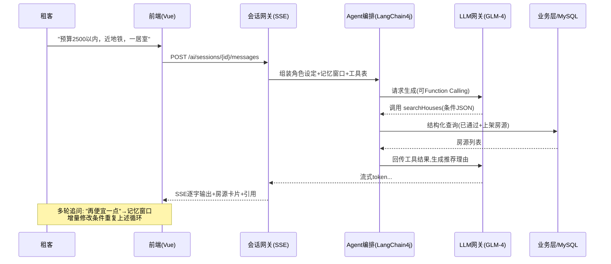

# RentAgent 概要设计说明

> 项目名称：RentAgent —— 基于 AI 智能体的房屋租赁系统
> 文档版本：v1.3（v1.3 修订日期：2026-09-15，表现层补充 TypeScript 并按实现同步，见版本记录）
> 编写日期：2026-09-13（按课程进度计划，2026-09-15"概要设计说明以及数据库设计简介"节点交付评审）
> 编制：王硕（组长 / 项目负责人）　参与评审：项目组全体
> 关联文档：《项目最终确认书》v1.1、《需求分析矩阵》v1.1、《数据库设计简介》v1.0、《需求跟踪矩阵》v1.1

---

## 一、引言

### 1.1 编写目的

本文档在《需求分析矩阵》v1.1 基线（FR-01~25、NFR-01~10）之上，给出 RentAgent 系统的总体架构、功能模块划分、智能体层设计、接口概要与关键流程设计，作为详细设计、迭代开发与测试计划的依据。读者为项目组全体成员、指导教师与评审组。

### 1.2 设计依据与约束

| 来源 | 约束内容 |
| ---- | -------- |
| 《项目最终确认书》v1.1 | 技术方案基线：Vue 3 前端 + Spring Boot 3.x 后端 + MySQL 8 / Redis 7 + GLM-4 API；范围外清单（不做支付对接、不做移动 App 等） |
| 《需求分析矩阵》v1.1 | 25 项功能需求（P0×10 / P1×12 / P2×3）、10 项非功能需求，本文档必须逐条覆盖或给出对策 |
| 课程要求 | 概要设计阶段交付《概要设计说明》与《数据库设计简介》；架构讲解按"应用项目架构"范式组织（本项目为 B/S 架构应用项目，与嵌入式项目"感知层—控制层—执行层"的分层关注点不同，见 2.2 节说明） |
| NFR 约束 | 性能（95% 接口 ≤ 2s）、AI 首字 ≤ 3s 流式输出、安全（JWT + RBAC + BCrypt）、AI 内容合规（引用来源 + 声明）等，对策见第八章 |

### 1.3 术语与缩略语

| 术语 | 说明 |
| ---- | ---- |
| RBAC | 基于角色的访问控制（租客 / 房东 / 管理员三类角色） |
| RAG | 检索增强生成：先从知识库检索相关片段，再交由大模型生成带引用的回答 |
| Function Calling | 大模型按预定义工具规范发起结构化调用，由系统执行真实操作后回传结果 |
| Agent 编排 | 围绕用户目标组织"理解 → 规划 → 调用工具 → 反思 → 交付"多步闭环的框架层 |
| LLM 网关 | 对大模型 API 的统一封装层，支持模型一键替换与限流降级 |
| SSE | Server-Sent Events，用于 AI 对话流式输出 |
| MVP | 最小可行产品，本项目即 P0 需求集合 |

## 二、总体设计

### 2.1 设计原则

1. **需求驱动**：每个设计单元均可追溯到 FR/NFR 编号，与《需求跟踪矩阵》双向对应；
2. **分层解耦**：表现层、业务层、智能体层、数据层职责单一，智能体层与业务层通过"工具接口"解耦（NFR-09 可插拔）；
3. **保 MVP、分级交付**：架构首先保障 P0 闭环（注册登录 → 发布房源 → 审核 → 检索 → AI 找房 → 智能客服 → 预约 → 签约），P1/P2 在同一架构上增量扩展；
4. **风险前置**：大模型 API 不稳定（风险 R1）用网关层隔离；AI 幻觉（风险 R2）用 RAG 强制引用 + 免责声明兜底。

### 2.2 架构风格说明（应用项目 vs 嵌入式项目）

本项目为典型的**应用项目（B/S 架构）**，采用"前后端分离 + 四层架构"；课堂上讲解的嵌入式项目架构以"感知层（传感器采集）— 控制层（MCU/RTOS 实时处理）— 执行层（驱动执行机构）+ 云端联动"为主线，关注实时性与资源受限。两者对比：

| 维度 | 应用项目（本项目） | 嵌入式项目 |
| ---- | ------------------ | ---------- |
| 交互方式 | 浏览器 HTTP(S)/SSE 请求响应 | 传感器/执行器物理信号交互 |
| 分层主线 | 表现层 → 业务层 → 智能体层 → 数据层 | 感知层 → 控制层 → 执行层（→ 云端） |
| 关键指标 | 并发、响应时间、可维护性 | 实时性、功耗、内存占用 |
| 数据设计 | 关系库 + 缓存 + 向量库 | 嵌入式数据库/文件/消息队列 |

RentAgent 中不存在设备侧感知与实时控制环节，故不引入嵌入式分层；仅 AI 对话采用 SSE 流式输出以满足"首字 ≤ 3s"的准实时体验（NFR-02）。

### 2.3 总体架构

```
┌───────────────────────────────────────────────────────────────┐
│ 表现层  React 18 + TypeScript + Vite + Ant Design 5 + ECharts     │
│        租客端（找房/对话/预约/签约）· 房东端（发布/定价/订单）      │
│        管理端（审核/用户/评价/看板）——响应式覆盖移动浏览           │
├───────────────────────────────────────────────────────────────┤
│ 接入层  Nginx：静态资源 + HTTPS + 反向代理 /api → 后端           │
├───────────────────────────────────────────────────────────────┤
│ 业务层  Spring Boot 3.x（RESTful API，Controller-Service-       │
│        Mapper 三层）                                            │
│        用户权限 · 房源管理 · 检索推荐 · 交易合同 · 评价消息 ·       │
│        后台管理 · 会话网关（SSE）                                │
│        横切：JWT 鉴权 + RBAC · 全局异常 · 参数校验 · 操作审计      │
├───────────────────────────────────────────────────────────────┤
│ 智能体层（Agent Layer，LangChain4j）                            │
│   会话路由 ── 意图识别 ── Agent 编排 ── 记忆管理（摘要+窗口）       │
│   工具集：房源检索 / 预约管理 / 合同生成与解读 / 定价分析 /          │
│          虚假房源检测（工具注册表，可插拔）                        │
│   RAG：知识库切片检索（平台规则 · 租赁政策 FAQ · 合同模板）         │
│   LLM 网关：三协议后端（OpenAI 兼容 / Anthropic / Responses）      │
├───────────────────────────────────────────────────────────────┤
│ 数据层  MySQL 8（业务库，18 张表）· Redis 7（缓存/会话/验证码）    │
│        Redis Stack（kb_chunk 向量索引，RAG 语义检索）             │
│        文件存储：房源图片（本地卷 + Nginx 托管，演示规模）          │
└───────────────────────────────────────────────────────────────┘
```

### 2.4 技术选型（按《项目最终确认书》基线）

| 层次 | 选型 | 设计要点 |
| ---- | ---- | -------- |
| 表现层 | React 18 + TypeScript + Vite + Ant Design 5 + ECharts | 三端单仓单应用，react-router 哈希路由按角色分区；Context 管登录态；AI 对话为 SSE 流式渲染；strict 模式类型检查（`tsc --noEmit && vite build`） |
| 后端 | Spring Boot 3.x + MyBatis-Plus + spring-security-crypto | Controller-Service-Mapper 分层；鉴权为自研 JWT 过滤器 + `@RequireRole` 角色拦截器（BCrypt 取自 spring-security-crypto）；springdoc-openapi 自动生成 Swagger 文档（NFR-08） |
| 智能体框架 | LangChain4j | Function Calling、ChatMemory、RAG（EmbeddingStore）工程化封装，Spring Boot starter 集成 |
| 大模型 | 多协议 LLM 网关：anthropic-messages（当前启用：智谱 GLM-5.3-flash 兼容端点）/ openai-chat-completions（DeepSeek、通义等）/ openai-responses（OpenAI 新接口，内置适配器） | 端点、API Key、模型均可配置；命名后端经 `AI_BACKEND` 一键切换；无有效 Key 自动降级内置规则引擎（风险 R1 应对）。anthropic-messages 与 openai-responses 均为本项目自研适配器（前者兼容 GLM 思维链块并关闭 thinking 降低首字延迟） |
| 数据库 | MySQL 8（InnoDB，utf8mb4） | 18 张业务表，详见《数据库设计简介》 |
| 缓存 | Redis 7 | 验证码、登录失败计数、JWT 黑名单、热点房源缓存、AI 热会话上下文 |
| 向量检索 | Redis Stack（RediSearch，部署就绪） | 向量索引为 RAG 升级预留位（`kb_chunk.vector_ref`）；首版知识库检索走关键词命中 + 计分 |
| 鉴权安全 | JWT + RBAC + BCrypt + AES | 三角色简化 RBAC（角色字段 + 方法级注解鉴权），敏感字段加密（NFR-03/04） |
| 部署 | Docker Compose 单机 | nginx / server / mysql / redis-stack 四容器，一键拉起演示环境 |

### 2.5 部署架构

```
                Docker Compose（单台云主机）
 ┌────────────────────────────────────────────────────┐
 │  [nginx]                                           │
 │   ├─ /            → Vue 3 构建产物（静态资源）        │
 │   ├─ /api/**      → http://server:8080（反向代理）  │
 │   └─ /uploads/**  → 房源图片卷                       │
 │  [server] Spring Boot 3（业务层 + 智能体层）          │
 │   ├─ → mysql:3306   业务库（每日全量备份脚本）         │
 │   ├─ → redis:6379   缓存/会话                        │
 │   └─ → GLM-4 API    出网（HTTPS，配额与超时管控）      │
 │  [mysql] MySQL 8      [redis-stack] Redis 7+RediSearch│
 └────────────────────────────────────────────────────┘
```

## 三、功能模块设计

### 3.1 模块划分

与《需求分析矩阵》七大能力模块一一对应：

```
┌────────────────────────────────────────────────────┐
│                租客端 / 房东端 / 管理端              │
├──────────┬──────────┬──────────┬──────────────────┤
│ 用户与权限 │ 房源管理  │ 检索与推荐 │  AI 智能体服务   │
│ FR-01~04  │ FR-05~08 │ FR-09~11  │  FR-12~16（特色） │
├──────────┼──────────┼──────────┴──────────────────┤
│ 交易与合同 │ 评价与消息 │ 后台管理                    │
│ FR-17~19  │ FR-20/21  │ FR-22~24                   │
└──────────┴──────────┴────────────────────────────┘
```

### 3.2 模块职责与设计要点

| 模块 | 覆盖需求 | 后端组件（包） | 关键设计要点 |
| ---- | -------- | -------------- | ------------ |
| 用户与权限 | FR-01~04 | `auth`、`user` | 注册即选角色；JWT 无状态登录 + Redis 失败计数（5 次锁 10 分钟）；禁用即时生效由每请求的用户状态校验保证；RBAC 三角色 `@RequireRole` 注解鉴权；实名信息 AES 加密存储（FR-03） |
| 房源管理 | FR-05~08 | `house` | 状态机：待审核 → 已通过/已驳回 → 已上架 → 已下架/已出租；编辑后回退待审核；仅"已通过且上架"进入检索域；图片上传后校验类型/大小；FR-08 识别结果走 `ai_analysis` 异步回填 |
| 检索与推荐 | FR-09~11、FR-25 | `search`、`favorite` | MySQL 组合索引 + LIKE 前缀匹配支撑关键词；筛选条件动态 SQL；地图找房按 lng/lat 范围查询（FR-10）；推荐 = 收藏/浏览行为加权 + Redis ZSet 热度榜（FR-11）；收藏唯一约束（FR-25） |
| AI 智能体服务 | FR-12~16 | `agent`（智能体层） | 详见第四章 |
| 交易与合同 | FR-17~19 | `appointment`、`contract`、`order` | 预约以 (房源, 时段) 唯一索引防重复（FR-17）；合同模板 + 信息自动填充生成，签约后状态流转与副本留存（FR-18）；签约成功生成租赁订单并按期生成租金账单（FR-19，仅记录不对接支付） |
| 评价与消息 | FR-20、FR-21 | `review`、`notification` | 评价以租赁订单唯一约束保证"仅完成合同可评、一单一评"；关键事件统一经 `NotificationService` 站内信触达（5 秒内可见，轮询/长连接） |
| 后台管理 | FR-22~24 | `admin` | 用户禁用即时生效（JWT 黑名单）；审核操作全量写 `audit_log` 留痕（FR-23）；看板为只读聚合查询，按日/周/月分组统计（FR-24） |

### 3.3 需求-模块追溯总览

| 模块 | 租客 | 房东 | 管理员 | AI 智能体 | P0 需求数 |
| ---- | ---- | ---- | ------ | --------- | --------- |
| 用户与权限 | ✔ | ✔ | ✔ | — | 2 |
| 房源管理 | — | ✔ | ✔ | ✔（FR-08） | 3 |
| 检索与推荐 | ✔ | — | — | ✔（工具支撑 FR-12） | 1 |
| AI 智能体服务 | ✔ | ✔ | ✔ | 主体 | 2 |
| 交易与合同 | ✔ | ✔ | — | ✔（FR-14/15/18） | 2 |
| 评价与消息 | ✔ | ✔ | — | — | 0 |
| 后台管理 | — | — | ✔ | ✔（FR-16） | 0 |

> 逐条 FR → 组件/表/接口的追溯在第四~六章内联标注，并与《数据库设计简介》第七章、《需求跟踪矩阵》保持同一编号体系。

## 四、AI 智能体层设计（项目特色）

### 4.1 组件结构

```
 用户消息(SSE)                                                        流式返回
    │                                                                    ▲
    ▼                                                                    │
┌─────────┐   ┌──────────┐   ┌────────────────────────────┐   ┌───────────┐
│ 会话网关  │ → │ 意图识别   │ → │ Agent 编排（LangChain4j）     │ → │ 合规护栏   │
│ 会话/记忆 │   │ 场景路由   │   │ 角色设定 · ReAct 规划 · 反思   │   │ 来源引用    │
└─────────┘   └──────────┘   │ 工具注册表（@Tool 注解扫描）    │   │ 免责声明    │
                             └───────────┬────────────────┘   └───────────┘
                    ┌────────────────────┼──────────────────────┐
                    ▼                    ▼                      ▼
              房源检索工具            RAG 检索器               LLM 网关
           （查 MySQL 房源域）   （知识库切片检索：关键词     （三协议后端可配置，
            预约/合同工具           命中+计分→引用溯源）        超时/降级/规则引擎兜底）
            定价/检测工具
```

### 4.2 核心机制

| 机制 | 设计 | 对应需求 |
| ---- | ---- | -------- |
| 会话路由 | 按 `scene`（找房助手 / 智能客服 / 合同解读）路由到不同角色设定与工具集；客服未命中知识库时礼貌转人工提示 | FR-12/13 |
| 工具注册表 | 业务方法以 `@Tool` 注解注册，Agent 运行时按需调用；新增工具只需注册定义，不改对话主流程 | FR-12/15/16、NFR-09 |
| 记忆管理 | Redis 维护热会话滑动窗口（近 N 轮）+ 超长时摘要压缩；会话与消息全量落库（`ai_chat_session` / `ai_chat_message`）支持回溯 | FR-12 多轮追问 |
| RAG | 知识库切片检索（首版为关键词命中 + 计分，向量检索升级位 `vector_ref` 已预留）；回答强制附带来源引用；合同/资金类问题只允许知识库口径作答 | FR-13、NFR-05、风险 R2 |
| LLM 网关 | 三协议后端适配（openai-chat-completions / anthropic-messages / openai-responses），端点、API Key、模型可配置，命名后端经 `AI_BACKEND` 一键切换；超时与降级话术；无有效 Key 降级规则引擎 | 风险 R1、NFR-09 |
| 流式输出 | SSE 逐 token 推送，首字 ≤ 3s | NFR-02 |
| AI 分析任务 | 定价建议、虚假房源检测、合同解读为"请求 → 异步分析 → 结果落 `ai_analysis`"模式，结果带依据与样本量；管理员保留最终裁决权 | FR-08/14/15/16 |

### 4.3 智能体工具清单（初始注册）

| 工具名 | 功能 | 输入 | 输出 | 支撑需求 |
| ------ | ---- | ---- | ---- | -------- |
| `searchHouses` | 结构化条件检索房源（区域/租金/户型/面积/朝向/设施/通勤） | 条件 JSON + 分页 | 房源卡片列表 | FR-12 |
| `getHouseDetail` | 查询房源详情与图片 | 房源 id | 详情 JSON | FR-12 |
| `createAppointment` | 为租客创建看房预约 | 房源 id + 时段 | 预约结果 | FR-12/17 |
| `analyzeContract` | 触发合同解读分析 | 合同 id | 风险条款 + 通俗解读 | FR-14 |
| `suggestPrice` | 同小区/同户型样本定价分析 | 房源草稿 | 区间/依据/样本量 | FR-15 |
| `detectFakeHouse` | 房源文本/图片一致性风险分析 | 房源 id | 风险分 + 疑点列表 | FR-16 |
| `searchKnowledge` | RAG 知识库检索 | 问题 | 片段 + 来源 | FR-13 |

## 五、接口概要设计

### 5.1 规范约定

| 项 | 约定 |
| -- | ---- |
| 风格 | RESTful，前缀 `/api/v1`；资源名复数小写（如 `/api/v1/houses`） |
| 认证 | `Authorization: Bearer <JWT>`；登录/注册/公开房源浏览白名单外全鉴权 |
| 授权 | 角色注解（`@RequireRole`）+ 资源属主校验，防水平/垂直越权（NFR-03） |
| 统一响应 | `{ "code": 0, "message": "ok", "data": … }`；业务错误码分段：1xxx 用户、2xxx 房源、3xxx 交易、4xxx AI、5xxx 系统 |
| 分页 | `page/size` 参数，响应含 `total`；默认 10 条，最大 50 |
| 文档 | springdoc-openapi 自动生成 Swagger UI（NFR-08） |

### 5.2 主要资源清单（概要）

| 模块 | 资源与方法（示例） | 需求 |
| ---- | ------------------ | ---- |
| 认证 | `POST /auth/register`、`POST /auth/login`、`POST /auth/captcha`、`PATCH /users/me/password` | FR-01/02/04 |
| 用户 | `POST /users/me/realname`、`GET/PATCH /users/me` | FR-03/04 |
| 房源 | `POST /houses`（房东）、`PUT /houses/{id}`、`PATCH /houses/{id}/status`、`GET /admin/houses/pending` + `PATCH …/audit` | FR-05/06/07 |
| 检索 | `GET /houses?keyword=&district=&rentMin=&rentMax=&layout=…`、`GET /houses/{id}`、`GET /houses/map`、`GET /recommendations` | FR-09/10/11 |
| 收藏 | `POST/DELETE /favorites/{houseId}`、`GET /favorites` | FR-25 |
| AI 会话 | `POST /ai/sessions`、`POST /ai/sessions/{id}/messages`（SSE 流式）、`GET /ai/sessions/{id}/history`、`GET /ai/engine`、`POST /ai/houses/{id}/pricing-suggestion`、`POST /ai/assist-fill` | FR-08/12/13/14/15 |
| 交易 | `POST /appointments`、`PATCH /appointments/{id}`（确认/拒绝/完成）、`POST /contracts`（生成）、`PATCH /contracts/{id}/sign`、`GET /orders`、`GET /orders/{id}/bills` | FR-17/18/19 |
| 评价 | `POST /reviews`、`GET /houses/{id}/reviews`、`POST /reports` | FR-20/23 |
| 通知 | `GET /notifications`、`PATCH /notifications/{id}/read` | FR-21 |
| 后台 | `GET /admin/users`、`PATCH /admin/users/{id}/status`、`GET /admin/reports`、`GET /admin/dashboard?granularity=day\|week\|month` | FR-22/23/24 |

> 完整字段、错误码与示例在《接口文档》（里程碑 2 后续交付物）中细化，本文档只锁定资源边界与规范。

## 六、关键流程设计

### 6.1 AI 找房助手（FR-12，P0）



### 6.2 房源发布与审核（FR-05/07/08/16，P0/P2）

```mermaid
sequenceDiagram
    participant L as 房东
    participant B as 业务层
    participant AI as 智能体层
    participant M as 管理员
    participant N as 通知服务

    L->>B: 提交房源(必填校验)
    B->>B: 状态=待审核; 实名校验前置
    opt P2: FR-08 智能识别
        B->>AI: 异步图片识别→ai_analysis
        AI-->>L: 识别结果一键填充(可改)
    end
    B->>N: 通知管理员有新房源
    M->>B: 审核(可触发FR-16虚假检测)
    B->>AI: detectFakeHouse→风险分+疑点
    alt 通过
        B->>B: 状态=已通过(可上架)
    else 驳回
        B->>N: 驳回理由→通知房东
    end
    B->>B: audit_log 留痕
```

### 6.3 在线签约（FR-18/19/14，P0/P1）

```mermaid
sequenceDiagram
    participant T as 租客
    participant B as 业务层
    participant AI as 智能体层
    participant L as 房东

    T->>B: 对已通过房源发起签约意向
    B->>B: 模板+双方信息自动填充生成合同(待双方确认)
    opt FR-14 合同解读
        T->>AI: analyzeContract(内嵌入口)
        AI-->>T: 逐条通俗解读+风险标红+"AI生成仅供参考"
    end
    T->>B: 确认签署(签名时间落库)
    B->>L: 推送签约请求
    L->>B: 确认签署
    B->>B: 合同生效→生成租赁订单
    B->>B: 按租期生成租金账单计划(仅记录)
    B->>B: 房源状态→已出租; 双方收到通知
```

## 七、数据架构概要

数据层由三部分组成，详细设计见《数据库设计简介》：

| 存储 | 用途 | 内容 |
| ---- | ---- | ---- |
| MySQL 8 | 业务主库，InnoDB / utf8mb4 | 18 张表，四大业务域：用户域（sys_user、realname_auth、notification）、房源域（house、house_image、favorite）、交易域（viewing_appointment、contract、lease_order、rent_bill、review、report、audit_log）、AI 域（ai_chat_session、ai_chat_message、ai_analysis、kb_document、kb_chunk） |
| Redis 7 | 缓存与会话 | 已实现：验证码（5 分钟 TTL）、登录失败计数（10 分钟锁定）；演进预留：房源详情缓存、推荐热度榜、AI 热会话窗口（首版分别由 DB 字段、SQL 排序与进程内会话记忆承担） |
| Redis Stack | 向量检索 | kb_chunk 切片 embedding（HNSW 索引），RAG 语义检索与来源溯源 |

数据一致性约定：AI 会话上下文以 MySQL 为准（首版热窗口在进程内，Redis 热窗口为演进预留），Redis 故障不丢数据；缓存一律"库写成功后失效/更新"；逻辑删除统一 `deleted` 字段，审计统一 `created_at/updated_at`。

## 八、非功能需求设计对策

| 编号 | 需求 | 设计对策 |
| ---- | ---- | -------- |
| NFR-01 | 95% 接口 ≤ 2s（并发 50） | 列表查询强制分页 + 组合索引；Nginx 静态资源直接出；Redis 缓存为演进预留（压测不达标即启用） |
| NFR-02 | AI 首字 ≤ 3s、流式输出 | SSE 全链路异步；LLM 网关禁缓冲、设首字超时熔断。实测注记（2026-09-14，GLM-5.3-flash 关闭 thinking 后）：找房（含 1 轮工具调用）首字约 12~15s、客服（含知识库工具）约 12s——首字耗时主要由工具调用轮次与该模型生成速度构成；演示场景可按 2.4 节切换更快模型（如 glm-4-flash 类）达标 |
| NFR-03 | 安全 | BCrypt 密码；JWT + 角色注解 + 属主校验；MyBatis 预编译防注入；输入过滤 + 前端转义防 XSS；接口层防重复提交 |
| NFR-04 | 隐私合规 | 身份证号 AES 加密存储 + 哈希比对；AI 上下文脱敏（不携带手机号/证件号出网）；最小化收集 |
| NFR-05 | AI 内容合规 | RAG 强制引用来源；合同/资金类回答附"AI 生成，仅供参考"声明；对话日志全量落库可追溯 |
| NFR-06 | 兼容性 | Element Plus 响应式栅格；≥375px 适配走查；目标浏览器 Chrome/Edge/Safari 近两个大版本 |
| NFR-07 | 可用性 ≥ 99%（演示期） | 健康检查 + 容器自动重启；核心接口全局异常兜底与友好错误页；每日全量备份 + 恢复脚本演练 |
| NFR-08 | 可维护性 | 分层架构 + Swagger + 核心模块（鉴权、预约、合同、Agent 工具）单元测试 |
| NFR-09 | 智能体可插拔 | 工具注册表模式：新增能力仅需新增 `@Tool` 定义与提示词片段，不改主流程 |
| NFR-10 | 备份恢复 ≤ 1h | mysqldump 每日全量 + 图片目录同步；恢复脚本纳入交付物；Redis/向量数据可由业务库重建 |

## 九、出错处理与日志

1. **全局异常处理器**：业务异常 → 统一错误码 + 中文提示；系统异常 → 5xxx 通用提示（不外泄堆栈），日志记录完整上下文；
2. **AI 降级链路**：LLM 超时/限流 → 自动重试一次 → 降级话术（"智能助手繁忙，已转人工/稍后再试"）；客服未命中知识库 → 转人工提示；
3. **日志规范**：`操作审计日志`（audit_log 表，留痕审核/禁用等管理动作）+ `应用日志`（SLF4J 分级，AI 调用记录 token 用量与延迟，用于 NFR-02 度量）。

## 十、设计阶段任务分解与分工

| 任务 | 负责人 | 产出 |
| ---- | ------ | ---- |
| 总体架构 / 智能体层设计 / 接口规范 | 王硕 | 本文档 |
| 数据库概念/逻辑/物理设计 | 李天泽 | 《数据库设计简介》 |
| 接口文档细化（字段/错误码/示例） | 王硕 + 邓颢琛 | 《接口文档》 |
| 智能体工具定义与提示词初稿 | 邓颢琛 | 工具注册清单 + 提示词库 |
| 三端页面设计对齐（对照原型 23 页） | 张卫雨、陈玄晔 | 前端工程骨架 |
| 设计评审组织 | 王硕 | 评审记录与整改清单 |

## 十一、版本记录

| 版本 | 日期 | 变更内容 | 评审人 |
| ---- | ---- | -------- | ------ |
| v1.0 | 2026-09-13 | 初版发布：确立四层架构、七模块划分、智能体层设计、接口规范、关键流程与非功能对策，支撑 2026-09-15 课程节点评审 | 项目组全体 |
| v1.1 | 2026-09-14 | 按实现同步口径：① LLM 网关升级为三协议多后端适配（openai-chat-completions / anthropic-messages / openai-responses，命名后端经 AI_BACKEND 切换，无 Key 降级规则引擎，智谱 GLM 走快捷单后端通道）；② 鉴权口径修正为自研 JWT 过滤器 + @RequireRole 拦截器（BCrypt 用 spring-security-crypto）；③ Redis/向量检索/RAG 条目标注"已实现 / 演进预留"状态；④ AI 资源清单补充 engine、定价建议、辅助填充端点 | 项目组全体 |
| v1.2 | 2026-09-14 | 表现层基线定为 React 18 + Vite + Ant Design 5（用户拍板，替换 Vue 3 + Element Plus，final 前端与原型载体统一）；LLM 网关接入真实模型：anthropic-messages 协议自研适配器（跳过 GLM thinking 块、thinking=disabled 降首字、支持 Function Calling 与 SSE 流式），当前启用智谱 GLM-5.3-flash 兼容端点；NFR-02 补充实测数据与达标路径 | 项目组全体 |
| v1.3 | 2026-09-15 | 前端代码全面 TypeScript 化（strict 模式）：15 页视图 + 公共模块类型化，新增公共类型定义 `src/types.ts`；构建链升级为 `tsc --noEmit && vite build`，类型零错误，页面视觉与交互与 v1.2 基线一致（浏览器实测通过） | 项目组全体 |

---

*配套文档：《数据库设计简介》《项目最终确认书》《需求分析矩阵》《需求跟踪矩阵》*
